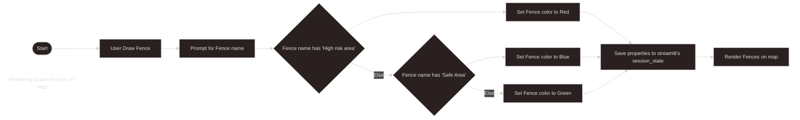

[Link for the demo](https://geofencing-with-appgit-vsfhnzcr7g2eak66sqwc2q.streamlit.app/)

## Flowchart For Rendering Drawn Shapes on map

```mermaid
---
config:
  theme: neo-dark
  layout: fixed
---
flowchart LR
    A(["Start"]) --> B["User Draw Fence"]
    B --> n2["Prompt for Fence name"]
    n2 --> n3@{ label: "Fence name has 'High risk area'" }
    n3 --> n6["Set Fence color to Red"]
    n3 -- Else --> n7@{ label: "Fence name has 'Safe Area'" }
    n7 --> n8["Set Fence color to Blue"]
    n7 -- Else --> n9["Set Fence color to Green"]
    n6 --> n10@{ label: "Save properties to streamlit's session_state" }
    n8 --> n10
    n9 --> n10
    n10 --> n11["Render Fences on map"]
    n1["Rendering Drawn Fences on Map"]
    B@{ shape: rect}
    n2@{ shape: rect}
    n3@{ shape: diam}
    n7@{ shape: diam}
    n10@{ shape: rect}
    n1@{ shape: text}

```
